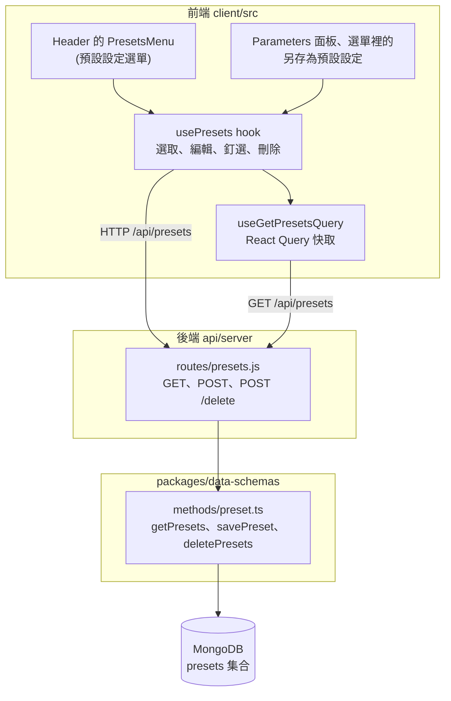

# 預設設定(Presets)

把一組對話設定(端點、模型、參數、系統提示)存成「預設設定」,之後一鍵套用到新對話。這份文件說明預設設定怎麼用、前後端怎麼接,以及階段 3 做了什麼。

> 介面上叫「預設設定」(英文是 preset)。它和 `librechat.yaml` 的 `modelSpecs` 長得很像,差別見[和 `modelSpecs` 的差別](#和-modelspecs-的差別)。

## 這個功能做什麼

| 能做的事 | 說明 |
|---|---|
| 另存為預設設定 | 把目前對話的設定(端點、模型、溫度等參數、系統提示、工具)存起來,取個名字 |
| 套用 | 在對話頁上方的「預設設定」選單點一個預設,就用它的設定開始(或切換)對話 |
| 預設的預設設定 | 選單裡每個項目有「釘選」按鈕,釘選的那一個會成為預設,開新對話時自動套用它的設定(例如提示起始字串)。同時只能有一個 |
| 編輯、刪除 | 每個項目有編輯與刪除按鈕;刪除前會再確認 |
| 匯入、匯出、全部清除 | 選單右上「…」可以匯入檔案、清除全部(清除前會再確認);編輯對話框可以匯出 |
| `@` 切換 | 在輸入框打 `@`,清單裡除了模型也有預設設定,選一個就切換過去 |
| 只屬於你自己 | 預設設定存在你的帳號底下,別人看不到 |

## 這個階段做了什麼

**沒有補任何檔案,也沒有改任何設定。** 預設設定的後端路由、資料模型、前端選單與對話框,在 MVP-1 就已經在專案內,`librechat.yaml` 的 `interface.presets` 也早就是 `true`(設了 `modelSpecs` 之後必須明確開啟,見[本機執行教學](../local/npm.md))。所以在 MVP-1 的畫面上,預設設定本來就能用。階段 3 做的是說明它怎麼運作,並驗證它。

## 歷史

| 時間 | 事件 |
|---|---|
| 2023-04 | 預設設定加入 |

## 怎麼運作

### API

| 方法與路徑 | 用途 |
|---|---|
| `GET /api/presets` | 列出自己的所有預設設定 |
| `POST /api/presets` | 儲存。**沒有就新增,有就更新**:用 `presetId` 找(沒給就由後端產生),找到就更新,找不到就新增 |
| `POST /api/presets/delete` | 刪除。給 `presetId` 刪那一個;body 是空的就刪掉自己全部的預設設定 |

三個路由都要登入,資料一律以登入者的 `user` 為條件,所以只能碰到自己的預設設定。儲存與列出時,內容會先經過設定檔 `filters` 的過濾。

### 資料

| 欄位 | 意思 |
|---|---|
| `presetId` | 唯一識別碼 |
| `title` | 顯示的名稱 |
| `user` | 擁有者 |
| `defaultPreset`、`order` | 是否為預設的預設設定。設為預設時 `order` 變成 `0`;同一個人同時只有一個預設,把另一個設為預設,原本那個的標記會被移除 |
| 其餘欄位 | 對話的設定欄位:`endpoint`、`endpointType`、`model`、`temperature`、`promptPrefix`、`tools` 等,和對話使用同一組欄位 |

列出時的排序:先依 `order`(沒有的視為排在最後),再依更新時間,新的在前。所以預設的預設設定永遠在最上面。

### 前端

| 檔案 | 作用 |
|---|---|
| `components/Chat/Menus/PresetsMenu.tsx` | 對話頁上方的「預設設定」按鈕與選單,也負責開啟另存、編輯、刪除確認三個對話框 |
| `components/Chat/Menus/Presets/PresetItems.tsx` | 選單的內容:清單、釘選、編輯、刪除、匯入、清除全部,以及空狀態「尚無預設設定」與「另存為預設設定」按鈕 |
| `components/Chat/Menus/Presets/EditPresetDialog.tsx` | 編輯預設設定的對話框 |
| `components/Endpoints/SaveAsPresetDialog.tsx` | 另存為預設設定的對話框,Parameters 面板與選單共用 |
| `hooks/Conversations/usePresets.ts` | 選取預設(用它的設定開新對話或切換目前對話)、儲存、釘選、刪除、匯入匯出,以及啟動時自動套用預設的預設設定 |
| `store/preset.ts`、`utils/presets.ts`、`utils/cleanupPreset.ts` | 狀態與資料整理 |
| `hooks/Input/useMentions.ts` | 輸入框 `@` 清單把預設設定也列進去 |

選單與 `usePresets` 的邏輯,都是先改前端的狀態,再呼叫 `POST /api/presets` 存檔,存完讓 `useGetPresetsQuery` 的快取更新。

## 和 `modelSpecs` 的差別

| | 預設設定(presets) | 模型規格(`modelSpecs`) |
|---|---|---|
| 誰建立 | 使用者自己,在介面上 | 管理員,寫在 `librechat.yaml` |
| 存在哪裡 | MongoDB 的 `presets` 集合,每人一份 | 設定檔,所有人共用 |
| 內容 | 一組對話設定 | 也包含一組設定(`preset` 欄位),另外有名稱與顯示名稱(`name`、`label`)、是否為預設(`softDefault`) |
| 開關 | `interface.presets` | `modelSpecs` 本身 |

我們的 `librechat.yaml` 用 `modelSpecs` 設定了預設用本機 Ollama 模型(`softDefault`);使用者自己建立的預設設定,則是各自的另一層。

## 驗證結果

預設設定只依賴既有檔案,所以驗證在專案的瀏覽器畫面,以及暫存區的 API 兩邊做。

| 項目 | 結果 |
|---|---|
| 專案內的畫面 | 對話頁上方模型選擇器旁有「預設設定」按鈕,點開顯示面板:標題「預設設定」、空狀態「尚無預設設定」、「另存為預設設定」按鈕、右上「…」選單 |
| 另存為預設設定 | 選單的「另存為預設設定」開啟對話框,名稱預設為 `New Chat` 並已全選,輸入「簡短回答」按「儲存」,出現提示「『簡短回答』已儲存!」。資料庫多了一筆,端點 `ollama`、模型 `qwen2.5:7b-instruct` |
| 選單清單 | 重新開啟選單,清單出現「簡短回答: qwen2.5:7b-instruct」,標頭顯示「無啟用的預設設定」;滑過項目才會出現三個按鈕:釘選、編輯、刪除 |
| 釘選(預設的預設設定) | 按釘選,出現提示「『簡短回答』現在是預設的預設設定。」;再開選單,標頭變成「預設值 簡短回答」,項目上的按鈕變成取消釘選。資料庫中該筆 `defaultPreset: true`、`order: 0` |
| 編輯 | 對話框標題「編輯預設集 — 簡短回答」,欄位有名稱、端點、模型、自訂名稱、提示起始字串、最大前後文 token 數、最大輸出 token 數、溫度、Top P、頻率懲罰、出現懲罰、停止序列等,底下有「匯出」與「儲存」。在提示起始字串填「請用一句話回答。」後儲存,資料庫的 `promptPrefix` 同步更新 |
| 自動套用 | 釘選之後重新載入並開新對話,問 `Explain how photosynthesis works.`,回覆只有一句話。資料庫裡這個新對話帶有 `promptPrefix: 請用一句話回答。`,同時 `spec` 仍是 `ollama-qwen`,也就是預設的預設設定與 `modelSpecs` 同時生效 |
| 刪除 | 按刪除,跳出確認對話框「要刪除預設集嗎?這會刪除 簡短回答」,確認後提示「預設集刪除成功」,資料庫的預設設定剩 0 筆 |
| 列出 `GET /api/presets` | 一開始回空陣列 `[]` |
| 儲存 `POST /api/presets` | 儲存 `title: 簡短回答`、`endpoint: Ollama`、`model: qwen2.5:7b-instruct`、`temperature: 0.3`,HTTP 201,後端產生 `presetId` |
| 更新 | 用同一個 `presetId` 再 POST,標題變 `A2`、溫度變 `0.9`,清單仍只有一筆 |
| 預設的預設設定 | 把 B 設為預設:B 的 `defaultPreset` 為 `true`、`order` 為 `0`,排第一;再把 A 設為預設:A 變第一,B 的標記被移除 |
| 刪除 | 給 `presetId` 刪一筆,`deletedCount: 1`;body 空的刪全部,`deletedCount: 2`,再列出回 `[]` |

## References

- [Message Composer(官方文件翻譯)](../official/features/composer.md):`@` 切換到預設、`+` 加入預設取得額外回覆
- [interface 物件(官方文件)](https://www.librechat.ai/docs/configuration/librechat_yaml/object_structure/interface):`presets` 一節
- [model_specs 物件(官方文件)](https://www.librechat.ai/docs/configuration/librechat_yaml/object_structure/model_specs):`preset` 欄位
- [api/server/routes/presets.js(官方 repo,rc4)](https://github.com/LibreChat-AI/LibreChat/blob/v0.8.8-rc4/api/server/routes/presets.js)
- [packages/data-schemas/src/methods/preset.ts(官方 repo,rc4)](https://github.com/LibreChat-AI/LibreChat/blob/v0.8.8-rc4/packages/data-schemas/src/methods/preset.ts)
- [client/src/components/Chat/Menus/PresetsMenu.tsx(官方 repo,rc4)](https://github.com/LibreChat-AI/LibreChat/blob/v0.8.8-rc4/client/src/components/Chat/Menus/PresetsMenu.tsx)
- [client/src/hooks/Conversations/usePresets.ts(官方 repo,rc4)](https://github.com/LibreChat-AI/LibreChat/blob/v0.8.8-rc4/client/src/hooks/Conversations/usePresets.ts)
- [提示詞](prompts.md)、[搜尋](search.md):前面的階段
- [路線圖](../roadmap.md):階段 3
