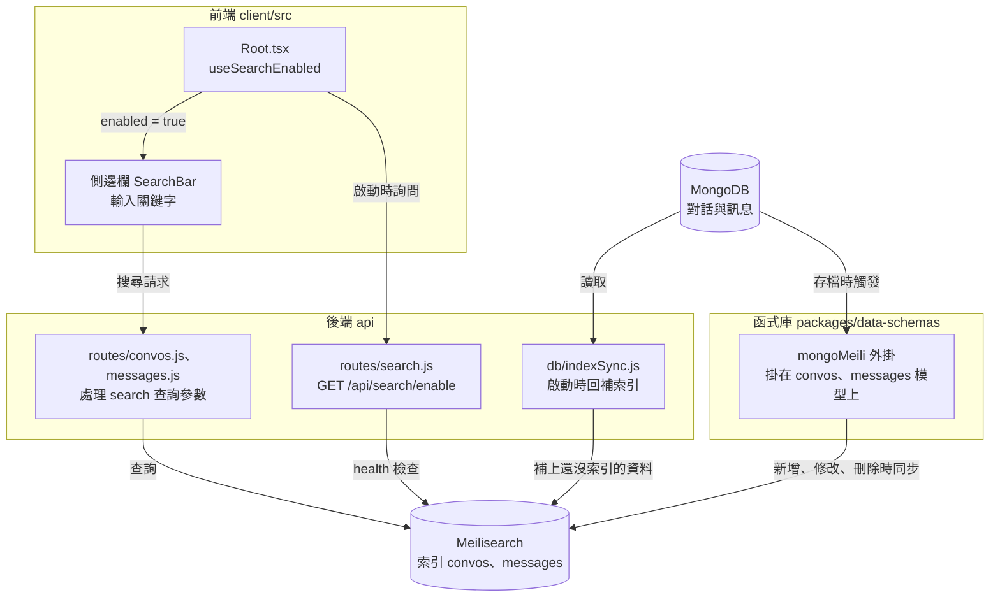

# 搜尋(Search)

在側邊欄的搜尋框輸入關鍵字,找出過去的對話,包括只在訊息內容裡出現的字。這份文件說明搜尋怎麼運作、怎麼在本機啟用,以及階段 2 做了什麼。

## 這個功能做什麼

| 能做的事 | 說明 |
|---|---|
| 搜尋框 | 側邊欄頂端的「搜尋訊息」。啟用後才會出現 |
| 搜尋範圍 | 對話標題、標籤,以及訊息內容 |
| 結果 | 側邊欄列出符合的對話;`/search` 頁面列出符合的訊息,每則有連到原對話的連結 |
| 錯字容忍 | 拼錯也找得到,例如 `knowlege` 找到 `Knowledge Cutoff Inquiry` |
| 即時 | 新的對話與訊息一送出就進入索引,不用重新啟動 |
| 關鍵字搜尋 | 比對你輸入的字,不是比對意思。搜「水果」找不到只講「香蕉」的訊息 |

## 這個階段做了什麼

**沒有補任何檔案。** 搜尋的後端路由、索引同步、資料模型外掛、前端的搜尋框,在 MVP-1 就已經在專案內,只是沒有 Meilisearch,所以功能是關閉的。階段 2 只做兩件事:

1. 另起一個 Meilisearch 容器。
2. 在 `.env` 打開 `SEARCH` 並填入連線資訊,重新啟動後端。

`tools/start.ps1` 也多了一步:偵測到 `learn-meilisearch` 容器就一起啟動。

## 歷史

| 時間 | 事件 |
|---|---|
| 2023-03-16 | release `v0.0.4` 說明列出「Message search」,對話搜尋加入 |

## 怎麼運作



| 環節 | 做什麼 |
|---|---|
| `GET /api/search/enable` | `SEARCH` 開啟,而且 Meilisearch 的 `health` 回 `available`,才回 `true`。其他情況(沒開、連不上)回 `false`,不報錯 |
| 前端 `useSearchEnabled` | 登入後呼叫上面的路由,把結果存進狀態;是 `true` 才顯示搜尋框 |
| `mongoMeili` 外掛 | 掛在對話與訊息的資料模型上。每次存檔、更新、刪除,就同步到 Meilisearch;文件裡的 `_meiliIndex` 旗標記錄「這筆已索引」。有設定 `MEILI_HOST` 與 `MEILI_MASTER_KEY` 才會掛上 |
| `indexSync`(啟動時) | 檢查資料庫裡有多少筆還沒索引,補進去。一筆都沒索引過時,強制完整同步 |

### 索引了哪些欄位

| 索引 | 欄位 |
|---|---|
| `convos`(對話) | `conversationId`、`title`、`user`、`tags` |
| `messages`(訊息) | `messageId`、`conversationId`、`user`、`sender`、`text`、`content` |

## 在本機啟用搜尋

官方 npm 版教學是下載 Meilisearch 執行檔。我們和 MongoDB 一樣,用 Docker 跑,環境變數則和官方相同。

### 1. 產生 master key

任何夠長的隨機字串(16 位元組以上)都可以。用 Node 產生一組:

```bash
node -e "console.log(require('crypto').randomBytes(32).toString('hex'))"
```

這把金鑰要同時給容器與 `.env`,**不要提交到 git**(`.env` 已被 `.gitignore` 排除,`.env.example` 的這一欄是空的)。

### 2. 啟動 Meilisearch 容器

把 `<你的金鑰>` 換成上一步產生的字串:

```bash
docker run -d --name learn-meilisearch -p 127.0.0.1:7701:7700 -v learn-meilisearch-data:/meili_data -e MEILI_MASTER_KEY=<你的金鑰> -e MEILI_NO_ANALYTICS=true getmeili/meilisearch:v1.35.1
```

| 參數 | 意思 |
|---|---|
| `--name learn-meilisearch` | 學習專用的容器名稱,和你其他的 Meilisearch 分開 |
| `-p 127.0.0.1:7701:7700` | 只開放本機連線,不對外。主機埠用 7701,避開 Meilisearch 預設的 7700(官方也提醒不要把 7700 公開到網路上) |
| `-v learn-meilisearch-data:/meili_data` | 獨立資料卷,容器刪掉資料還在 |
| `MEILI_MASTER_KEY` | 之後 LibreChat 連線用的金鑰 |
| `MEILI_NO_ANALYTICS=true` | 關閉匿名遙測 |
| `v1.35.1` | 與官方 `docker-compose.yml` 使用的版本相同 |

確認它在跑:

```bash
curl http://127.0.0.1:7701/health
```

回應 `{"status":"available"}` 就可以了。

### 3. 修改 `.env`

`.env.example` 已經有這幾行,只要改值:

```
SEARCH=true
MEILI_NO_ANALYTICS=true
MEILI_HOST=http://localhost:7701
MEILI_MASTER_KEY=<你的金鑰>
```

### 4. 重新啟動並驗證

用[一鍵啟動](../local/npm.md#一鍵啟動),日誌會出現:

```
[mongoMeili] Creating new index: convos
[mongoMeili] Creating new index: messages
[indexSync] Messages need syncing: 0/8 indexed
```

日誌裡的數字依你資料庫裡原有的對話與訊息而不同。之後再啟動,會變成 `Messages are fully synced`。打開 `http://localhost:3090/`,側邊欄頂端就有「搜尋訊息」。

這個容器沒有設自動重啟,**Docker 重開後要手動啟動**:`docker start learn-meilisearch`。用一鍵啟動腳本的話,它會幫你做。

## 驗證結果

| 項目 | 結果 |
|---|---|
| Meilisearch 容器 | `health` 回 `available` |
| 啟動回補 | 資料庫裡既有的 2 個對話、8 則訊息全部進入索引(Meilisearch 統計 2 與 8) |
| 側邊欄 | 頂端多了「搜尋訊息」 |
| 搜尋訊息內容 | 搜「散步」找到標題為「今天的天氣很好」的對話(標題沒有這個字,比對到的是訊息內容)。`/search` 頁面顯示符合的訊息,各有連到原對話的連結 |
| 錯字容忍 | 輸入 `knowlege`,找到 `Knowledge Cutoff Inquiry` |
| 新訊息即時索引 | 送出新訊息 `Reply with the single word pineapple.`,索引從 2 對話、8 訊息變成 3 對話、10 訊息;Meilisearch 搜尋 `pineapple` 命中 2 則(問與答) |
| 再次啟動 | 日誌 `Messages are fully synced: 10/10`、`Conversations are fully synced: 3/3` |
| 一鍵啟動 | 從 MongoDB、Meilisearch 都停止的狀態啟動,腳本依序啟動兩個容器、等 Meilisearch 回應、再啟動 LibreChat |

## 補充

- **只有 Meilisearch 沒跑時**:`/api/search/enable` 回 `false`,搜尋框不出現,聊天不受影響。
- **同步重設**:官方有 `npm run reset-meili-sync`(Meilisearch 資料遺失或損毀時,強制完整重新同步)。它要用到根目錄的 `config/` 資料夾,專案要到收尾階段才會帶入,現在還不能使用。
- **其他同步變數**:`MEILI_NO_SYNC`、`MEILI_SYNC_BATCH_SIZE`、`MEILI_SYNC_DELAY_MS`、`MEILI_SYNC_THRESHOLD`,說明見官方設定頁的翻譯。

## References

- [Message Search(官方文件翻譯)](../official/features/search.md)
- [Meilisearch(官方文件翻譯)](../official/configuration/meilisearch.md)
- [Message Search(官方文件)](https://www.librechat.ai/docs/features/search)
- [Meilisearch(官方文件)](https://www.librechat.ai/docs/configuration/meilisearch)
- [api/server/routes/search.js(官方 repo,rc4)](https://github.com/LibreChat-AI/LibreChat/blob/v0.8.8-rc4/api/server/routes/search.js)
- [api/db/indexSync.js(官方 repo,rc4)](https://github.com/LibreChat-AI/LibreChat/blob/v0.8.8-rc4/api/db/indexSync.js)
- [mongoMeili.ts(官方 repo,rc4)](https://github.com/LibreChat-AI/LibreChat/blob/v0.8.8-rc4/packages/data-schemas/src/models/plugins/mongoMeili.ts)
- [MongoDB](../mongodb.md):學習專用容器的做法
- [本機執行教學](../local/npm.md)、[路線圖](../roadmap.md):階段 2
- [build-order](../build-order.md):搜尋的 release 時間
